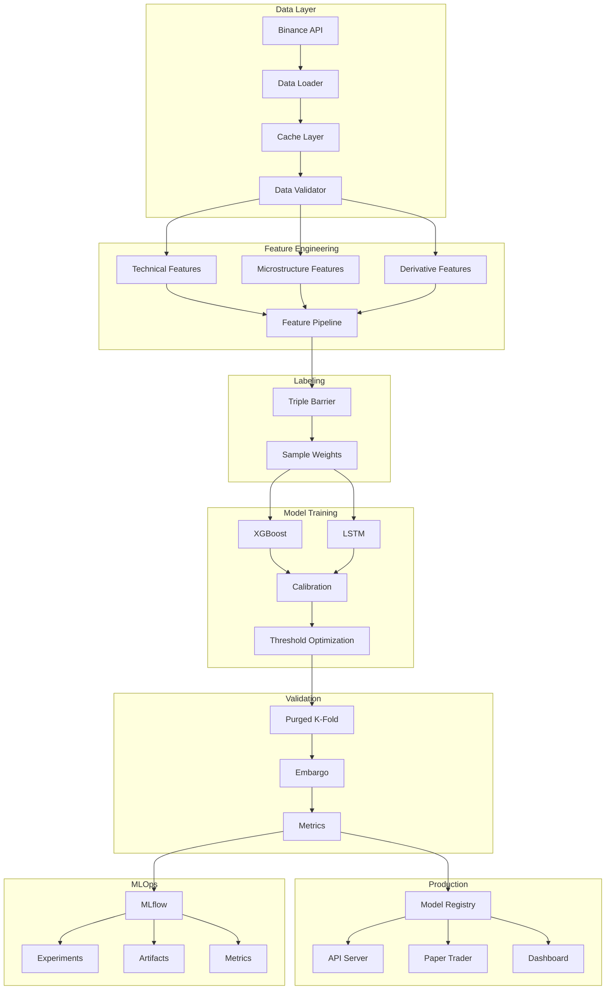

# 🏗️ System Architecture

## Overview

This document describes the architecture of the ML Trading Pipeline system, a production-ready machine learning platform for cryptocurrency trading using advanced time series analysis and ensemble methods.

## System Design Principles

1. **Modularity**: Each component is self-contained and loosely coupled
2. **Reproducibility**: Deterministic training with fixed seeds and versioned data
3. **Scalability**: Designed to handle multiple symbols and timeframes
4. **Observability**: Comprehensive logging, tracking, and monitoring
5. **Security**: Defense in depth with multiple security layers
6. **Testability**: Every component has comprehensive test coverage

## High-Level Architecture



## Component Architecture

### 1. Data Layer (`src/data/`)

```
┌──────────────────────────────────────┐
│           Data Layer                  │
├──────────────────────────────────────┤
│ • binance_loader.py                  │
│   - REST API integration             │
│   - WebSocket support (future)       │
│   - Rate limiting                    │
│   - Retry logic                      │
│                                      │
│ • Cache Management                   │
│   - Parquet format                   │
│   - Hash-based validation            │
│   - TTL policies                     │
│                                      │
│ • Data Validation (Pandera)          │
│   - Schema enforcement               │
│   - Type checking                    │
│   - Range validation                 │
│   - Monotonicity checks              │
└──────────────────────────────────────┘
```

**Key Design Decisions:**
- Parquet format for efficient storage and fast I/O
- Pandera for runtime data validation
- Local cache to minimize API calls
- Fallback to yfinance for redundancy

### 2. Feature Engineering (`src/features/`)

```
┌──────────────────────────────────────┐
│        Feature Engineering            │
├──────────────────────────────────────┤
│ • engineering.py                     │
│   - Price features (returns, ratios) │
│   - Technical indicators (100+)      │
│   - Rolling statistics               │
│   - Lookback windows                 │
│                                      │
│ • microstructure.py                  │
│   - Order Book Imbalance (OBI)       │
│   - VPIN                             │
│   - Kyle's Lambda                    │
│   - Roll measure                     │
│                                      │
│ • derivatives.py                     │
│   - Funding rates                    │
│   - Open interest                    │
│   - Basis spreads                    │
│   - Liquidation metrics              │
│                                      │
│ • labels.py                          │
│   - Triple Barrier Method            │
│   - Dynamic barriers (ATR)           │
│   - Sample weights                   │
│   - Class balancing                  │
└──────────────────────────────────────┘
```

**Key Design Decisions:**
- No future information leakage (careful with rolling windows)
- Fit scalers only on training data
- Parallel processing for expensive computations
- Modular feature groups for easy testing

### 3. Model Layer (`src/models/`)

```
┌──────────────────────────────────────┐
│           Model Layer                 │
├──────────────────────────────────────┤
│ • xgb_optuna.py                      │
│   - Bayesian optimization            │
│   - Pruning strategies               │
│   - Feature importance               │
│   - Calibration                      │
│                                      │
│ • lstm_optuna.py                     │
│   - Sequence modeling                │
│   - Attention mechanisms             │
│   - Dropout regularization           │
│   - Gradient clipping                │
│                                      │
│ • ensemble.py                        │
│   - Voting classifier                │
│   - Stacking                         │
│   - Weighted averaging               │
│   - Meta-learner                     │
│                                      │
│ • Calibration & Thresholds           │
│   - Isotonic regression              │
│   - Platt scaling                    │
│   - F1 optimization                  │
│   - EV optimization                  │
└──────────────────────────────────────┘
```

**Key Design Decisions:**
- Optuna for efficient hyperparameter search
- Mandatory calibration for probability estimates
- Double threshold strategy (long/short/neutral)
- Scikit-learn compatible interface for all models

### 4. Validation Layer (`src/data/splits.py`)

```
┌──────────────────────────────────────┐
│         Validation Layer              │
├──────────────────────────────────────┤
│ • Purged K-Fold                      │
│   - Remove overlapping samples       │
│   - Maintain temporal order          │
│   - Respect label horizons           │
│                                      │
│ • Embargo                            │
│   - Gap between train/val            │
│   - Prevent information leakage      │
│   - Configurable periods             │
│                                      │
│ • Walk-Forward Analysis              │
│   - Expanding window                 │
│   - Rolling window                   │
│   - Anchored window                  │
└──────────────────────────────────────┘
```

**Key Design Decisions:**
- Never use standard K-Fold for time series
- Embargo size based on label horizon
- Always maintain chronological order
- Sample weights preserved through splits

### 5. Backtesting Engine (`src/backtest/`)

```
┌──────────────────────────────────────┐
│        Backtesting Engine             │
├──────────────────────────────────────┤
│ • Trade Execution                    │
│   - T+1 execution rule               │
│   - Slippage modeling                │
│   - Transaction costs                │
│   - Position sizing                  │
│                                      │
│ • Risk Management                    │
│   - Kelly criterion                  │
│   - Volatility targeting             │
│   - Maximum leverage                 │
│   - Drawdown limits                  │
│                                      │
│ • Performance Metrics                │
│   - Sharpe ratio                     │
│   - Sortino ratio                    │
│   - Maximum drawdown                 │
│   - Calmar ratio                     │
│   - Win rate                         │
│   - Profit factor                    │
└──────────────────────────────────────┘
```

**Key Design Decisions:**
- Vectorized operations for speed
- Realistic cost modeling (fees + slippage + funding)
- T+1 execution to prevent look-ahead bias
- Multiple position sizing methods

### 6. MLOps Infrastructure (`src/mlops/`)

```
┌──────────────────────────────────────┐
│         MLOps Infrastructure          │
├──────────────────────────────────────┤
│ • MLflow Integration                 │
│   - Experiment tracking              │
│   - Hyperparameter logging           │
│   - Metric tracking                  │
│   - Artifact storage                 │
│                                      │
│ • Model Registry                     │
│   - Version control                  │
│   - Stage management                 │
│   - Champion/Challenger              │
│   - Rollback capability              │
│                                      │
│ • Model Validator                    │
│   - Metric thresholds                │
│   - Overfitting checks               │
│   - Data drift detection             │
│   - Performance monitoring           │
└──────────────────────────────────────┘
```

**Key Design Decisions:**
- MLflow for standardized tracking
- Semantic versioning for models
- Automated promotion based on metrics
- Comprehensive validation before deployment

### 7. Dashboard (`src/dashboard/`)

```
┌──────────────────────────────────────┐
│           Dashboard                   │
├──────────────────────────────────────┤
│ • Pages                              │
│   - Overview (metrics, status)       │
│   - Performance (equity, drawdown)   │
│   - Features (importance, SHAP)      │
│   - Threshold Tuning (interactive)   │
│   - Live Trading (positions, P&L)    │
│   - MLflow (experiments, runs)       │
│                                      │
│ • Real-time Updates                  │
│   - WebSocket connections            │
│   - Auto-refresh                     │
│   - Live charts                      │
│                                      │
│ • Interactive Controls               │
│   - Model selection                  │
│   - Timeframe adjustment             │
│   - Threshold sliders                │
│   - Export functionality             │
└──────────────────────────────────────┘
```

**Key Design Decisions:**
- Streamlit for rapid development
- Caching for performance
- Plotly for interactive charts
- Session state for user preferences

## Data Flow

### Training Pipeline

```
1. Data Ingestion
   └─> Cache Check
       └─> API Fetch (if needed)
           └─> Validation
               └─> Feature Engineering
                   └─> Labeling
                       └─> Train/Val Split
                           └─> Model Training
                               └─> Hyperparameter Optimization
                                   └─> Calibration
                                       └─> Threshold Optimization
                                           └─> Validation Metrics
                                               └─> MLflow Logging
                                                   └─> Model Registry
```

### Inference Pipeline

```
1. New Data
   └─> Validation
       └─> Feature Engineering
           └─> Model Prediction
               └─> Calibration
                   └─> Threshold Application
                       └─> Signal Generation
                           └─> Risk Management
                               └─> Order Execution
                                   └─> Position Update
```

## Security Architecture

### Defense in Depth

```
┌──────────────────────────────────────┐
│         Security Layers               │
├──────────────────────────────────────┤
│ 1. Code Security                     │
│   • Static analysis (bandit)         │
│   • Type checking (mypy)             │
│   • Linting (ruff, black)            │
│                                      │
│ 2. Dependency Security               │
│   • pip-audit                        │
│   • safety checks                    │
│   • License compliance               │
│                                      │
│ 3. Secret Management                 │
│   • detect-secrets                   │
│   • .env files (never committed)     │
│   • Environment variables            │
│                                      │
│ 4. Data Security                     │
│   • Encryption at rest               │
│   • API key rotation                 │
│   • Access logging                   │
│                                      │
│ 5. Runtime Security                  │
│   • Input validation                 │
│   • Rate limiting                    │
│   • Error handling                   │
└──────────────────────────────────────┘
```

## Scalability Considerations

### Horizontal Scaling
- Stateless model servers
- Load balancing for API
- Distributed training (future)

### Vertical Scaling
- GPU acceleration for LSTM
- Multi-threading for XGBoost
- Vectorized operations

### Data Scaling
- Partitioned storage
- Incremental processing
- Streaming updates (future)

## Technology Stack

### Core Technologies
- **Python 3.11+**: Primary language
- **XGBoost 2.0+**: Gradient boosting
- **PyTorch 2.0+**: Deep learning
- **Pandas/NumPy**: Data manipulation
- **Scikit-learn**: ML utilities

### Infrastructure
- **MLflow**: Experiment tracking
- **Streamlit**: Dashboard
- **Docker**: Containerization
- **GitHub Actions**: CI/CD
- **DVC**: Data versioning (optional)

### Development Tools
- **Pytest**: Testing framework
- **Pre-commit**: Git hooks
- **Black/Ruff**: Code formatting
- **Mypy**: Type checking
- **Jupyter**: Notebooks

## Performance Optimizations

### Training Optimizations
- Early stopping
- Pruning (Optuna)
- Parallel CV folds
- GPU acceleration (LSTM)

### Inference Optimizations
- Model quantization (future)
- Batch predictions
- Caching
- Lazy loading

### Data Optimizations
- Parquet format
- Column pruning
- Chunked processing
- Index optimization

## Monitoring and Observability

### Metrics Collection
```python
# Application metrics
- Model latency
- Prediction throughput
- API response times
- Error rates

# Business metrics
- Sharpe ratio
- Win rate
- Drawdown
- P&L

# System metrics
- CPU/Memory usage
- Disk I/O
- Network traffic
- Queue depths
```

### Logging Strategy
- Structured logging (JSON)
- Log levels (DEBUG/INFO/WARN/ERROR)
- Correlation IDs
- Centralized aggregation (future)

### Alerting Rules
- Model degradation
- Data drift
- System failures
- Trading anomalies

## Deployment Architecture

### Development Environment
```
Local Machine
├── Virtual Environment
├── Local MLflow
├── File-based cache
└── Streamlit (localhost)
```

### Production Environment (Future)
```
Cloud Platform
├── Kubernetes Cluster
│   ├── Model Servers (pods)
│   ├── API Gateway
│   └── Load Balancer
├── Managed Services
│   ├── PostgreSQL (MLflow)
│   ├── S3 (artifacts)
│   └── Redis (cache)
└── Monitoring
    ├── Prometheus
    ├── Grafana
    └── AlertManager
```

## Future Enhancements

### Short-term (1-3 months)
- WebSocket data feeds
- Real-time inference
- Multi-asset portfolio
- Advanced risk metrics

### Medium-term (3-6 months)
- Reinforcement learning
- Market regime detection
- Cross-exchange arbitrage
- Social sentiment analysis

### Long-term (6-12 months)
- Distributed training
- AutoML capabilities
- Multi-strategy ensemble
- Blockchain integration

## Conclusion

This architecture provides a robust, scalable, and maintainable foundation for machine learning-based cryptocurrency trading. The modular design allows for easy extension and modification while maintaining system integrity and performance.

---
**Last Updated**: 2025-08-22
**Version**: 1.0.0
**Author**: ML Trading Pipeline Team