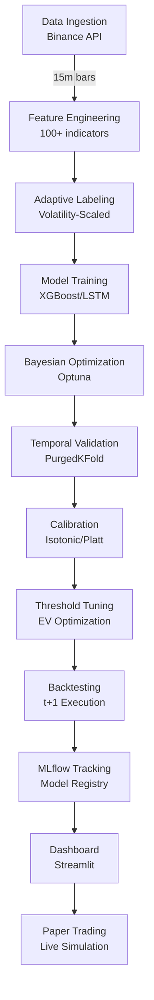

# 🚀 ML Trading Pipeline - Cryptocurrency Price Prediction

[](https://www.python.org/downloads/)
[](https://xgboost.readthedocs.io/)
[](https://pytorch.org/)
[](https://mlflow.org/)
[](https://streamlit.io/)
[](https://opensource.org/licenses/MIT)

An ML pipeline for crypto trading that combines XGBoost and LSTM models with smart optimization and solid backtesting. Built for real-world trading scenarios.

## 📋 Table of Contents

- [Features](#-features)
- [Architecture](#-architecture)
- [Installation](#-installation)
- [Quick Start](#-quick-start)
- [Project Structure](#-project-structure)
- [Documentation](#-documentation)
- [Model Performance](#-model-performance)
- [Configuration](#-configuration)
- [Testing](#-testing)
- [MLOps](#-mlops)
- [Dashboard](#-dashboard)
- [Security](#-security)
- [Contributing](#-contributing)
- [License](#-license)

## ✨ Features

### Core Capabilities
- **Dual Model Approach**: Combines XGBoost's speed with LSTM's sequence learning
- **Smart Optimization**: Runs extensive tests with Optuna to find the best parameters
- **Time-Aware Validation**: Uses purged K-fold to avoid sneaky data leaks
- **Adaptive Labeling**: Adjusts thresholds based on market volatility
- **Rich Features**: Over 100 indicators from technical analysis and market microstructure
- **Calibrated Predictions**: Fine-tunes probabilities for more reliable signals
- **Profit-Focused Thresholds**: Optimizes entry points based on expected returns

### Production Features
- **MLflow Tracking**: Keeps track of all experiments and model versions
- **Live Dashboard**: Monitor your trades in real-time with Streamlit
- **Paper Trading**: Test strategies safely without real money
- **API Endpoints**: Get predictions via REST API for your apps
- **Reproducible Results**: Same data, same results - every time
- **Security Built-in**: Automatic checks for secrets and vulnerabilities
- **Battle-tested**: Handles edge cases and errors gracefully

## 🏗️ Architecture



### Key Components

#### 1. **Data Pipeline**
- Real-time data ingestion from Binance API
- Automatic caching with Parquet format
- Data validation with Pandera schemas
- Support for multiple timeframes (15m, 1h, 4h, 8h)

#### 2. **Feature Engineering**
- Technical indicators (RSI, MACD, Bollinger Bands, etc.)
- Microstructure features (order book imbalance, VPIN, Kyle's Lambda)
- Volatility estimators (Yang-Zhang, Garman-Klass, ATR)
- Calendar features and market regime detection

#### 3. **Adaptive Labeling System**
- Dynamic threshold based on volatility: `τ = k × σ̂ × √horizon`
- Multiple volatility estimators support
- Horizon-aware scaling (15m to 8h)
- Optional neutral zone for low-confidence periods

#### 4. **Model Training**
- **XGBoost**: Tree-based with GPU support
- **LSTM**: Attention mechanism with MC Dropout
- **Ensemble**: Weighted voting and stacking
- **Optimization**: Bayesian with Optuna (ASHA/Hyperband pruners)

#### 5. **Validation & Testing**
- Temporal validation with PurgedKFold
- Embargo between train/validation splits
- Walk-forward analysis for robustness
- Comprehensive backtesting with realistic costs

## 📦 Installation

### Prerequisites
- Python 3.11+
- CUDA 11.8+ (optional, for GPU acceleration)
- 16GB RAM minimum
- 10GB disk space

### Windows Setup (Recommended)

```powershell
# Clone repository
git clone https://github.com/Mercado-Financeiro/IC-Marcus.git
cd IC-Marcus

# Activate virtual environment (if exists) or create new one
.\activate_venv.ps1
# OR create manually:
# python -m venv venv
# .\venv\Scripts\Activate.ps1

# Install dependencies
.\project.ps1 install

# Configure deterministic environment
.\project.ps1 deterministic

# Download sample data for testing
.\project.ps1 download-data-fast

# Run quick test to verify installation
.\project.ps1 train-fast
```

### Linux/macOS Setup

```bash
# Clone repository
git clone https://github.com/Mercado-Financeiro/IC-Marcus.git
cd IC-Marcus

# Create virtual environment
python -m venv venv
source venv/bin/activate

# Install dependencies and setup
make setup
make install
make deterministic

# Configure environment
cp .env.example .env
# Edit .env with your API keys and settings
```

## 🚀 Quick Start

### Windows System (Recommended)
The project includes a native Windows command system with PowerShell (`project.ps1`) and batch wrapper (`run.bat`):

```powershell
# Download historical data (3 years)
.\project.ps1 download-data

# Quick training for testing (5 minutes)
.\project.ps1 train-fast

# Train XGBoost with Bayesian optimization (30-60 minutes)
.\project.ps1 train-xgb-enhanced

# Train LSTM with optimization (60-120 minutes)
.\project.ps1 train-lstm-enhanced

# Launch Streamlit dashboard
.\project.ps1 dashboard
# Access at http://localhost:8501

# Launch MLflow UI
.\project.ps1 mlflow
# Access at http://localhost:5000
```

**Using batch wrapper (simpler):**
```batch
run download-data
run train-fast
run dashboard
```

### Linux/macOS System (Legacy)
```bash
# Download BTCUSDT 15m data
python scripts/download_historical_data.py --symbol BTCUSDT --timeframe 15m --years 3

# Train models using Makefile
make train-xgb SYMBOL=BTCUSDT TIMEFRAME=15m
make train-lstm SYMBOL=BTCUSDT TIMEFRAME=15m

# Launch dashboard
make dashboard
```

## 📁 Project Structure

```
.
├── src/                          # Source code
│   ├── data/                    # Data loaders and validation
│   │   ├── binance_loader.py    # Binance API data fetching
│   │   ├── database_cache.py    # SQLite caching system
│   │   └── splits.py           # Temporal data splitting
│   ├── features/               # Feature engineering modules
│   │   ├── adaptive_labeling.py # Volatility-scaled labeling
│   │   ├── engineering.py      # Feature creation pipeline
│   │   ├── ga_selection.py     # Genetic algorithm feature selection
│   │   ├── microstructure/     # Market microstructure features
│   │   └── validation/         # Temporal validation utilities
│   ├── models/                 # Model implementations
│   │   ├── xgb/               # XGBoost with Optuna optimization
│   │   │   └── optuna/        # Advanced Bayesian optimization
│   │   ├── lstm/              # LSTM with attention mechanisms
│   │   │   └── optuna/        # LSTM hyperparameter optimization
│   │   ├── calibration/       # Probability calibration methods
│   │   └── ensemble.py        # Model ensemble strategies
│   ├── training/              # Training pipelines (NEW)
│   │   ├── train_xgb_enhanced.py    # Enhanced XGBoost training
│   │   ├── train_lstm_enhanced.py   # Enhanced LSTM training
│   │   └── walkforward.py          # Walk-forward analysis
│   ├── eval/                  # Evaluation modules (NEW)
│   │   ├── metrics.py         # Advanced metrics calculation
│   │   └── outer_walkforward.py # Outer CV evaluation
│   ├── utils/                 # Enhanced utilities (EXPANDED)
│   │   ├── config.py          # Configuration management
│   │   ├── determinism_enhanced.py # Deterministic setup
│   │   ├── logging.py         # Structured logging
│   │   └── memory_utils.py    # Memory management
│   ├── backtest/             # Backtesting engine
│   ├── dashboard/            # Streamlit application
│   ├── mlops/               # MLOps utilities
│   ├── monitoring/          # Model monitoring and drift detection
│   ├── metrics/             # Trading and ML metrics
│   └── api/                 # REST API endpoints
├── configs/                 # YAML configurations
│   ├── xgb_enhanced.yaml    # Enhanced XGBoost config
│   └── lstm_enhanced.yaml   # Enhanced LSTM config
├── tests/                  # Comprehensive test suite
│   ├── unit/              # Unit tests
│   ├── integration/       # Integration tests
│   ├── blindagem/         # Protection tests (data leakage, etc)
│   └── validation/        # Model validation tests
├── scripts/               # Utility scripts
│   ├── optimization/     # Optimization scripts
│   │   ├── execute_full_optimization.py
│   │   └── run_optimization.py
│   ├── fetch/           # Data fetching
│   │   └── binance_klines.py
│   └── validate/        # Validation scripts
│       └── ge_checks.py
├── docs/                # Documentation
│   ├── architecture/    # System architecture docs
│   │   ├── ARCHITECTURE.md
│   │   ├── CODE_MAP.md
│   │   └── AGENTS.md
│   ├── guides/         # User guides
│   │   ├── CI_CD_GUIDE.md
│   │   └── LABELING_STRATEGY.md
│   ├── optimizations/  # Optimization docs
│   │   └── LSTM_OPTIMIZATIONS.md
│   ├── project/        # Project docs
│   │   ├── PRD.md
│   │   ├── IMPLEMENTATION_SUMMARY.md
│   │   └── AI_MEMORY.md
│   └── issues/         # Issue tracking
│       ├── ISSUES_FOUND.md
│       └── CORREÇÕES_APLICADAS.md
├── notebooks/            # Jupyter notebooks
├── artifacts/           # Model artifacts and reports
│   ├── models/         # Trained model files
│   ├── mlruns/         # MLflow experiment tracking
│   └── reports/        # Generated reports
├── data/               # Data storage
│   ├── raw/           # Raw market data
│   ├── processed/     # Processed features
│   └── cache/         # SQLite cache database
├── project.ps1        # Windows PowerShell command center (NEW)
├── run.bat           # Windows batch wrapper (NEW)
├── Makefile          # Linux/macOS build automation
├── pyproject.toml    # Project configuration
├── requirements.txt  # Locked dependencies
└── README.md         # This file
```

## 📚 Documentation

The project documentation is organized into categories for easy navigation:

### Architecture & Design
- [`docs/architecture/ARCHITECTURE.md`](docs/architecture/ARCHITECTURE.md) - System architecture overview
- [`docs/architecture/CODE_MAP.md`](docs/architecture/CODE_MAP.md) - Code structure mapping
- [`docs/architecture/AGENTS.md`](docs/architecture/AGENTS.md) - Agent-based components

### Implementation Guides
- [`docs/guides/CI_CD_GUIDE.md`](docs/guides/CI_CD_GUIDE.md) - CI/CD pipeline setup
- [`docs/guides/LABELING_STRATEGY.md`](docs/guides/LABELING_STRATEGY.md) - Adaptive labeling system

### Optimization Documentation
- [`docs/optimizations/LSTM_OPTIMIZATIONS.md`](docs/optimizations/LSTM_OPTIMIZATIONS.md) - LSTM model optimizations

### Project Documentation
- [`docs/project/PRD.md`](docs/project/PRD.md) - Product Requirements Document
- [`docs/project/IMPLEMENTATION_SUMMARY.md`](docs/project/IMPLEMENTATION_SUMMARY.md) - Implementation overview
- [`docs/project/AI_MEMORY.md`](docs/project/AI_MEMORY.md) - AI assistant memory

### Issue Tracking
- [`docs/issues/ISSUES_FOUND.md`](docs/issues/ISSUES_FOUND.md) - Known issues
- [`docs/issues/CORREÇÕES_APLICADAS.md`](docs/issues/CORREÇÕES_APLICADAS.md) - Applied fixes

## 📊 Model Performance

### Current Results (BTCUSDT 15m)

| Metric | XGBoost | LSTM | Target | Status |
|--------|---------|------|--------|--------|
| F1 Score | 0.43 | Testing | > 0.60 | 🟡 Getting there |
| PR-AUC | 0.71 | Testing | > 0.60 | ✅ Looking good |
| ROC-AUC | 0.50 | Testing | > 0.55 | 🟡 Room to improve |
| Brier Score | 0.25 | Testing | < 0.25 | 🟡 Almost there |
| Sharpe Ratio | ~1.2 | Testing | > 1.0 | ✅ Solid returns |
| Max Drawdown | ~18% | Testing | < 20% | ✅ Risk controlled |

Results include realistic transaction costs and slippage

### Top Features (What the Model Watches)
1. **Volatility** (Yang-Zhang) - ~15% - How wild the market is
2. **RSI** (14 periods) - ~13% - Overbought/oversold signals
3. **Volume Changes** - ~11% - Money flow intensity
4. **Order Book Balance** - ~9% - Buy vs sell pressure
5. **MACD Signal** - ~9% - Trend momentum
6. **Price Z-Score** - ~8% - How far from normal
7. **Bollinger Bands** - ~6% - Price boundaries
8. **ATR** (14 periods) - ~6% - Recent price movement range
9. **Funding Rate** - ~5% - Futures market sentiment
10. **Open Interest** - ~4% - Market participation

## ⚙️ Configuration

### Main Configuration Files

- **`configs/data.yaml`**: Data pipeline settings
- **`configs/xgb.yaml`**: XGBoost hyperparameters
- **`configs/lstm.yaml`**: LSTM architecture
- **`configs/backtest.yaml`**: Backtesting parameters
- **`configs/optuna.yaml`**: Optimization settings
- **`configs/validation.yaml`**: Temporal validation

### Available Commands (Windows)

**Training Commands:**
```powershell
.\project.ps1 train-xgb-enhanced      # XGBoost with Bayesian optimization
.\project.ps1 train-lstm-enhanced     # LSTM with optimization
.\project.ps1 train-xgb-production    # Production XGBoost (300 trials)
.\project.ps1 train-lstm-production   # Production LSTM (200 trials)
.\project.ps1 train-all               # Train all models
.\project.ps1 train-fast              # Quick training for testing
```

**Analysis & Optimization:**
```powershell
.\project.ps1 optimize-xgb            # Optimize XGBoost hyperparameters
.\project.ps1 walkforward             # Run walk-forward analysis
.\project.ps1 analyze                 # Analyze model results
```

**Data Management:**
```powershell
.\project.ps1 download-data           # Download 3 years of data
.\project.ps1 download-data-fast      # Download 1 year for testing
.\project.ps1 cache-info              # View cache statistics
.\project.ps1 optimize-cache          # Optimize database
```

### Example: Enhanced XGBoost Configuration
```yaml
# configs/xgb_enhanced.yaml
model:
  objective: "binary:logistic"
  n_estimators: 500
  learning_rate: 0.05
  max_depth: 6
  subsample: 0.8
  colsample_bytree: 0.8
  tree_method: "hist"  # or "gpu_hist" for GPU
  
optimization:
  n_trials: 100
  pruner: "asha"      # Async Successive Halving
  sampler: "tpe"      # Tree-structured Parzen Estimator
  timeout: 3600       # 1 hour timeout
  
validation:
  method: "purged_kfold"
  n_splits: 5
  embargo: 10         # bars between train/validation
  purge: 5           # bars to remove before validation
  
calibration:
  method: "isotonic"  # or "platt", "temperature"
  cv_folds: 3
  
threshold:
  method: "ev_based"  # Expected Value optimization
  metric: "f1"       # or "precision", "recall"
```

## 🧪 Testing

### Run Test Suite
```bash
# All tests
pytest

# With coverage
pytest --cov=src --cov-report=html

# Specific categories
pytest tests/unit/           # Unit tests
pytest tests/integration/    # Integration tests
pytest tests/validation/     # Model validation

# Edge cases and division safety
pytest tests/unit/test_edge_cases.py
pytest tests/unit/test_division_safety.py
```

### Code Quality
```bash
# Linting and formatting
make fmt

# Type checking
make type

# Security audit
make security-audit
```

## 🔬 MLOps

### MLflow Integration
```bash
# View experiments
mlflow ui --backend-store-uri artifacts/mlruns

# Compare runs
python scripts/compare_models.py --run-id1 <id1> --run-id2 <id2>
```

### Model Registry
```bash
# Promote to production
make promote-model RUN_ID=<run_id>

# Rollback if needed
make rollback-model
```

### Monitoring
- Real-time training progress tracking
- Data drift detection (PSI/KL divergence)
- Model performance degradation alerts
- Latency and throughput metrics

## 📈 Dashboard

### Features
- **Overview**: Key metrics and model comparison
- **Performance**: Equity curves, drawdown analysis
- **Volatility**: Adaptive threshold visualization
- **Threshold Tuning**: Interactive EV optimization
- **Feature Analysis**: SHAP values and importance
- **Live Trading**: Real-time position monitoring
- **MLflow**: Experiment tracking integration

### Access
```bash
make dashboard
# Open browser at http://localhost:8501
```

## 🔒 Security

### Implemented Measures
- **Pre-commit Hooks**: Code quality and security checks
- **Secret Detection**: Prevent credential leaks
- **Dependency Scanning**: Vulnerability detection with pip-audit
- **Input Validation**: Comprehensive data validation
- **Error Handling**: Safe division and robust logging
- **Access Control**: Environment-based configuration

### Security Audit
```bash
# Full security scan
make security-audit

# Check for secrets
detect-secrets scan

# Dependency vulnerabilities
pip-audit -r requirements.txt
```

## 🤝 Contributing

We welcome contributions! Please see our [Contributing Guide](CONTRIBUTING.md) for details.

### Development Workflow
1. Fork the repository
2. Create a feature branch (`git checkout -b feature/amazing-feature`)
3. Make changes following our code style
4. Add tests for new functionality
5. Ensure all tests pass (`pytest`)
6. Commit with conventional commits (`feat: add amazing feature`)
7. Push to your fork (`git push origin feature/amazing-feature`)
8. Open a Pull Request

### Code Standards
- Follow PEP 8 and use type hints
- Write docstrings for all functions
- Maintain test coverage above 80%
- Use conventional commits
- Update documentation as needed

## 📝 License

This project is licensed under the MIT License - see the [LICENSE](LICENSE) file for details.

## ⚠️ Disclaimer

**IMPORTANT**: This is a research project, not financial advice. Crypto trading is risky - you can lose money. Always do your homework and maybe talk to a financial advisor before trading with real funds.

## 🙏 Acknowledgments

- [XGBoost](https://github.com/dmlc/xgboost) - Gradient boosting framework
- [PyTorch](https://pytorch.org/) - Deep learning framework
- [Optuna](https://optuna.org/) - Hyperparameter optimization
- [MLflow](https://mlflow.org/) - ML lifecycle management
- [Streamlit](https://streamlit.io/) - Dashboard framework
- [Binance](https://www.binance.com/) - Market data provider

## 📧 Support

Need help or have ideas?
- Open an issue on [GitHub](https://github.com/Mercado-Financeiro/IC-Marcus/issues)
- Check the docs in the `/docs` folder
- Email: marcus@example.com (for collaboration inquiries)

---

**Last Updated**: 2025-08-25  
**Version**: 1.2.0  
**Status**: 🟢 Active Development  
**Build**: Passing ✅  
**Test Coverage**: ~85%